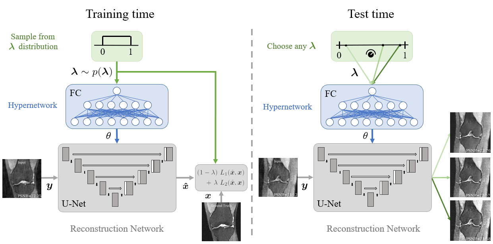

# HyperRecon: Computing Multiple Image Reconstructions with a Single Hypernetwork
HyperRecon is a method for producing multiple reconstructions corresponding to different loss functions with a single model.

It can also serve as a general purpose library for learning-based image reconstruction.
Current forward models supported are compressed sensing MRI (CS-MRI), superresolution, and denoising.

# Instructions
## Requirements
This code was tested on:

- python 3.7.10
- pytorch 1.4.0
- numpy 1.19.2

Note that in recent versions of Pytorch (e.g. 1.10), the function `torch.fft()` has been deprecated and has been moved to `torch.fft.fft()`, as well as other changes (e.g. outputting complex types instead of 2-channel).
Additionally, we found that `BatchConv2d` runs nearly 2x slower in later versions of Pytorch.

## Hypernetwork
The hypernetwork model is located in `hyperrecon/model/hypernetwork.py`.

To use a hypernetwork in your own model, replace a given `Conv2d` layer with `hyperrecon/model/layers/BatchConv2d` layer. The forward call takes as input the feature maps and the output of the hypernetwork.

## Data
The code provides an `Arr` class which loads a numpy array for use in a dataset. The paths to the train dataset and test dataset can be provided by the `--train_path` and `--test_path` flags. 
Dataset shapes are expected to be `[num_imgs, 1, l, w]`.
More sophisticated dataloaders can be integrated by changing the `get_dataloader` function in `hyperrecon/util/train.py` accordingly.

## Training 
To run the code with default parameters, a bash script is provided:

    bash train.sh

This script assumes the data is of shape (256, 256) in order to match the shapes of provided under-sampling masks. If your data has a different size, then specify the path to the under-sampling mask in the `--mask_path` flag.

Here are some detailed options for each flag:

    python -u run.py \
      --models_dir out/
      --train_path ... \
      --test_path ... \
      --mask_path data/poisson_disk_8p3_256_256.npy
      -fp uhs_l1_ssim \
      --log_interval 25 \
      --image_dims 256 256 \
      --lr 0.001 \
      --batch_size 32 \
      --num_epochs 100 \
      --arch hyperunet \                    # Specifies architecture, can be one of [hyperunet or unet]
      --hnet_hdim 128 \                     # Specifies hypernetwork hidden dimension
      --unet_hdim 32 \                      # Specifies main Unet hidden channel dimension
      --forward_type csmri \                # Specifies forward model, can be one of [csmri, superresolution, denoising]
      --undersampling_rate $RATE \          # Specifies under-sampling rate of mask for CS-MRI
      --loss_list l1 ssim \                 # Specifies losses
      --method base_train \                 # Specifies training strategy, can be one of [base_train, dhs]
      --distribution uniform                # Specifies sampling distribution for hyperparameter, can be one of [uniform, uniform_oversample, constant]

# HyperRecon Papers
If you use HyperRecon or some part of the code, please cite:

[Regularization-Agnostic Compressed Sensing MRI Reconstruction with Hypernetworks](https://arxiv.org/abs/2101.02194)   
Machine Learning for Medical Image Reconstruction @ MICCAI, 2020   
Alan Q. Wang, Adrian V. Dalca, Mert R. Sabuncu.   

[Computing Multiple Image Reconstructions witha Single Hypernetwork](https://www.melba-journal.org/papers/2022:017.html)   
Machine Learning for Biomedical Imaging (MELBA) Journal
Alan Q. Wang, Adrian V. Dalca, Mert R. Sabuncu.   
